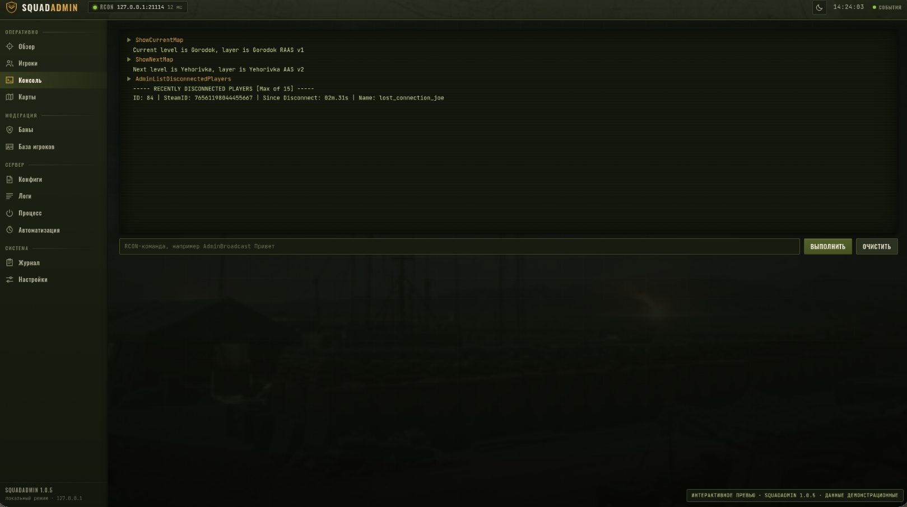
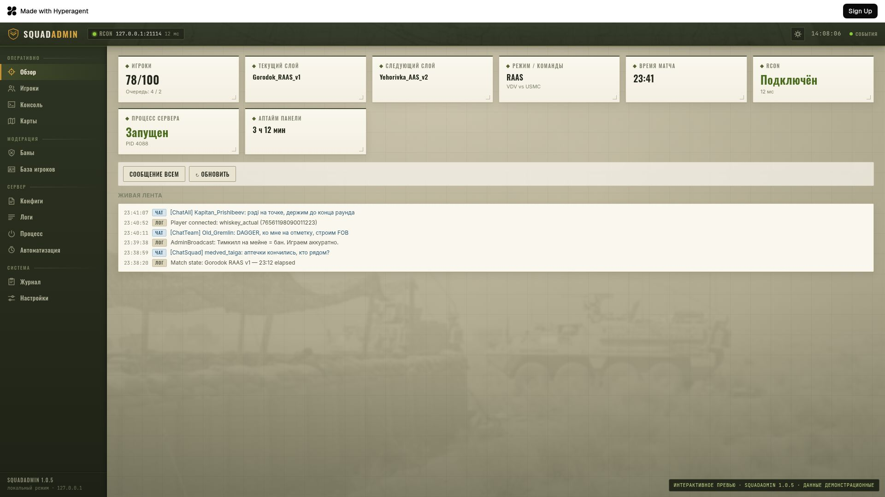
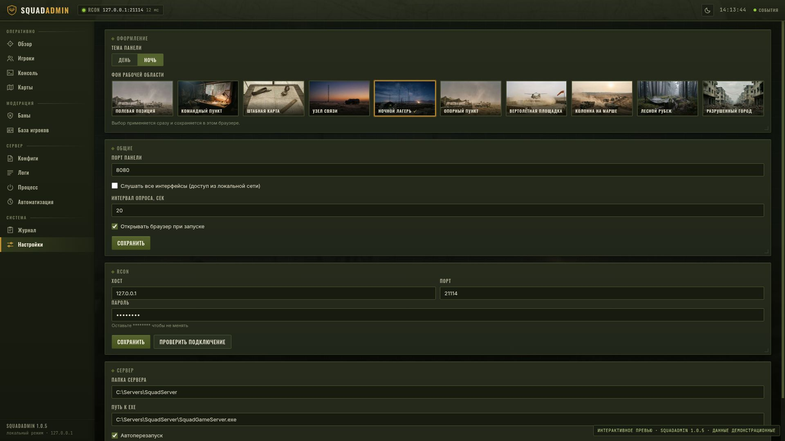

<div align="center">

# 🎖️ SquadAdmin

### Панель администрирования Squad-сервера — один `.exe`, без зависимостей

[English](README.md) · **Русский**

[](https://github.com/CympakHardLife/Squad-Admin-panel/actions/workflows/ci.yml)
[](LICENSE)
[](https://go.dev)
[]()
[](../../releases)
[]()

Полноценная веб-панель управления вашим выделенным сервером **Squad**.
Игроки, RCON-консоль, карты, баны, конфиги, логи, моды, управление процессом и автоматизация —
всё в одной портативной программе, которая работает на той же машине, что и сервер.

</div>

---

## ✨ Главное

<table>
<tr>
<td width="33%" valign="top">

### 📦 Один файл
`SquadAdmin.exe` — без установщика, без Node, без Python, без библиотек.
Положил в папку и запустил.

</td>
<td width="33%" valign="top">

### 🔌 Работает офлайн
Шрифты, стили и скрипты вшиты в программу.
Из интернета не подгружается ничего.

</td>
<td width="33%" valign="top">

### 🌍 Интерфейс RU / EN
Переключение языка одной кнопкой в верхней панели.
Журнал, логи и уведомления тоже переводятся.

</td>
</tr>
</table>

---

## 📸 Скриншоты

<div align="center">

<br><br>

<br><br>

</div>

---

## 🚀 Быстрый старт

```text
1. Скопируйте SquadAdmin.exe в отдельную папку, например C:\SquadAdmin\
   ВНИМАНИЕ: НЕ кладите его в папку Squad-сервера — рядом с exe создаются свои файлы.
2. Запустите двойным щелчком.
3. Предупреждение SmartScreen → «Подробнее» → «Выполнить в любом случае»
   (это нормально для программ без платной цифровой подписи).
4. Откроется браузер по адресу  http://127.0.0.1:8080
5. Логин и пароль не нужны — панель слушает только локальный адрес.
```

> ⚠️ **Окно консоли закрывать нельзя** — пока оно открыто, панель работает.
> Чтобы остановить — закройте окно или нажмите в нём `Ctrl+C`.

**Обновление с прошлой версии:** закройте панель, замените `SquadAdmin.exe`, запустите снова.
`config.json` и `data.db` обновятся сами — баны, заметки и настройки останутся на месте.
Если хотите гарантированную возможность откатиться — заранее скопируйте `data.db`
(подробности в разделе про 1.0.7 ниже).

---

## ⚙️ Настройка

Всё настраивается в разделе **Настройки** внутри панели. Обязательных пунктов всего два.

<details>
<summary><b>1 · RCON — без него не работает модерация</b></summary>
<br>

Возьмите данные из файла `<папка сервера>\SquadGame\ServerConfig\Rcon.cfg`:

```ini
Password=вашпароль      ← пароль RCON
Port=21114              ← порт RCON
```

| Поле | Значение |
|---|---|
| Адрес | `127.0.0.1` (панель и сервер на одной машине) |
| Порт | из `Rcon.cfg`, обычно `21114` |
| Пароль | из `Rcon.cfg` |

Нажмите **«Проверить подключение»** — должно появиться название вашего сервера.

> Squad **не поднимает** RCON, если пароль в `Rcon.cfg` пустой, а сервер должен быть
> запущен с параметром `RCONPORT=<порт>`.

</details>

<details>
<summary><b>2 · Папка сервера — для конфигов, логов и управления процессом</b></summary>
<br>

| Поле | Что указать | Пример |
|---|---|---|
| Папка сервера | Корень установки Squad-сервера | `C:\servers\squad` |
| Папка конфигов | Оставьте пустым — определится сама | `…\SquadGame\ServerConfig` |
| Файл лога | Оставьте пустым — определится сам | `…\SquadGame\Saved\Logs\SquadGame.log` |
| Exe сервера | Нужен для запуска/остановки из панели | `C:\servers\squad\SquadGameServer.exe` |
| Аргументы запуска | Те же, что в вашем `.bat` | `Port=7787 QueryPort=27165 RCONPORT=21114` |

Нажмите **«Проверить папку»** — панель покажет, сколько конфигов найдено и виден ли лог.

Всё остальное — игроки, консоль, карты, баны, база игроков, автоматизация —
работает по одному только RCON.

</details>

<details>
<summary><b>3 · Папка с модами — необязательно, для раздела «Моды»</b></summary>
<br>

Настройки → **Моды** → поле **«Папка с модами»**. Этот путь **не определяется автоматически**:
моды у всех лежат по-разному, поэтому папку указываете вы сами.

| Как установлены моды | Типичный путь |
|---|---|
| Steam Workshop | `…\steamapps\workshop\content\393380` |
| Вручную / своя папка | та папка, куда вы их скачиваете |

Каждая подпапка внутри считается отдельным модом. Нажмите **«Проверить папку»** — панель
сразу скажет, сколько модов нашла.

Если сервер без модов — оставьте поле пустым, раздел **«Моды»** просто предложит указать путь.

</details>

<details>
<summary><b>4 · Цвета чата — необязательно, для наглядности</b></summary>
<br>

Настройки → **«Цвета чата»**. Подсвечивает сообщения в чате цветом роли отправителя, чтобы
строка администратора не терялась среди остальных.

| Настройка | Что делает |
|---|---|
| Подсвечивать сообщения чата цветом роли отправителя | Общий выключатель всей функции |
| Роли из `Admins.cfg` | Поставьте галочку у группы и выберите цвет — список групп читается из файла |
| Канал ChatAdmin (админ-чат) | Запасной цвет для админ-чата, если у отправителя нет цвета роли |

Нужна указанная папка конфигов — именно там лежит `Admins.cfg`. Если групп нет, панель прямо
об этом скажет: *«Группы не найдены: укажите папку сервера и заполните Admins.cfg»*.

</details>

---

## 🧩 Возможности

| Раздел | Что умеет |
|---|---|
| 📊 **Обзор** | Статус сервера, число игроков, текущая и следующая карта, живая лента событий |
| 👥 **Игроки** | Дерево команд и отрядов, поиск, предупреждение, кик, бан, смена команды, роспуск отряда, снятие командира |
| 💻 **Консоль** | Любые RCON-команды с подсказками автодополнения и историей |
| 🗺️ **Карты** | Список слоёв, смена текущей и следующей карты, завершение и рестарт матча |
| 🚫 **Баны** | Локальная база банов со сроками, редактированием, разбаном и экспортом в формате `Bans.cfg` |
| 🗂️ **База игроков** | История ников, сессии, общее время игры, наказания, заметки админов |
| 📝 **Конфиги** | Редактирование любого `.cfg`, структурный редактор `Admins.cfg` (группы и права галочками), редактор ротации |
| 📜 **Логи** | Чат, тимкиллы, входы и выходы, ошибки, плюс просмотр сырого лога — сообщения чата подсвечены по роли |
| 🧱 **Моды** | Список модов из указанной папки с именами и версиями, редактор их файлов настроек с бэкапами |
| ⚡ **Процесс** | Запуск, остановка и перезапуск сервера, предупреждение игроков, автоперезапуск при падении |
| 🤖 **Автоматизация** | Сообщения по интервалу и расписанию, команды и рестарты по расписанию, режим сидинга |
| 🧾 **Журнал** | Всё, что делала панель: команды, баны, правки конфигов, срабатывания правил |

---

## 📁 Файлы рядом с exe

```text
C:\SquadAdmin\
├── SquadAdmin.exe
├── config.json     — настройки (можно править вручную при закрытой панели)
└── data.db         — SQLite: баны, игроки, заметки, правила, журнал
```

**Резервная копия** = скопировать `config.json` и `data.db`.

Перед каждой записью в конфиг сервера панель создаёт бэкап рядом с оригиналом
(`Server.cfg.bak-20260802-194452`), хранятся последние 10. С файлами настроек модов всё так же,
только бэкапы появляются рядом с самим файлом мода — внутри папки модов.

---

## 🛠️ Частые задачи

<details>
<summary><b>Открыть панель с другого компьютера в локальной сети</b></summary>
<br>

Настройки → Общие → включить **«Слушать на всех интерфейсах»** → сохранить → перезапустить
`SquadAdmin.exe`. Заходить по адресу `http://<IP-компьютера>:8080`.
Возможно, потребуется разрешить порт в брандмауэре Windows.

> 🔒 **Никогда не пробрасывайте этот порт в интернет.** У панели нет пароля —
> любой, кто до неё достучится, получит полный доступ. Только доверенная локальная сеть.

</details>

<details>
<summary><b>Сменить порт панели</b></summary>
<br>

Настройки → Общие → **«Порт панели»**, затем перезапустить программу.
Если панель не стартует из-за занятого порта — отредактируйте поле `general.panelPort`
в `config.json` через «Блокнот».

</details>

<details>
<summary><b>Запускать панель вместе с Windows</b></summary>
<br>

`Win+R` → `shell:startup` → положите в открывшуюся папку ярлык на `SquadAdmin.exe`.

</details>

<details>
<summary><b>Автоперезапуск сервера при падении</b></summary>
<br>

Раздел «Процесс» → переключатель **«Автоперезапуск при падении»**. Панель проверяет процесс
каждые 5 секунд. Если сервер падает больше 3 раз за 10 минут, автоперезапуск останавливается —
это признак постоянной проблемы, которую нужно искать в логах.

</details>

<details>
<summary><b>Режим сидинга</b></summary>
<br>

Автоматизация → Добавить правило → **«Сидинг»**. Задайте порог включения (например, меньше
20 игроков), порог выключения (например, больше 50), сидинговый слой и боевой слой. Панель
сама сменит карту и напомнит игрокам о сидинге. Пороги специально разные, чтобы режим не
переключался туда-сюда на границе.

</details>

<details>
<summary><b>Выделить сообщения админов в ленте чата</b></summary>
<br>

1. Убедитесь, что указана папка конфигов и в `Admins.cfg` есть ваши группы.
2. Настройки → **«Цвета чата»** → включите **«Подсвечивать сообщения чата цветом роли отправителя»**.
3. Поставьте галочки у нужных групп (например, `SuperAdmin`, `Moderator`) и выберите цвет каждой.
4. При желании задайте цвет канала **ChatAdmin** — он применится к сообщениям админ-чата от тех,
   у кого нет цвета роли.

Цвета применяются сразу во всех открытых вкладках. Наведите курсор на подсвеченное сообщение —
покажется название роли.

</details>

<details>
<summary><b>Отредактировать настройки мода</b></summary>
<br>

Настройки → Моды → укажите **«Папку с модами»** → откройте раздел **«Моды»**.

- У мода со статусом **«доступны»** файлы настроек уже есть — щёлкните по моду, затем по файлу.
- Статус **«появятся после запуска игры»** значит, что мод ещё не создал свои файлы. Большинство
  модов создают их при первом запуске сервера с модом. Запустите сервер и вернитесь — список
  обновляется при каждом запуске и остановке сервера, либо нажмите **«Обновить»**.

Редактируются файлы `.cfg`, `.ini`, `.json`, `.txt` и `.config`. Новые файлы панель не создаёт —
их должен породить сам мод.

</details>

---

## 🩺 Если что-то не работает

| Проблема | Решение |
|---|---|
| Панель не открывается в браузере | Проверьте, что окно консоли открыто и в нём нет строки `ERROR`; откройте `http://127.0.0.1:8080` вручную |
| Красная плашка «RCON не подключён» | Сервер выключен, неверный порт или пароль, либо сервер запущен без `RCONPORT`. Жмите «Проверить подключение» |
| Раздел «Логи» пустой | Squad пишет лог только во время работы; панель читает файл с момента своего запуска и не разбирает старые записи |
| Антивирус удалил exe | Go-программы без подписи попадают под эвристику — добавьте папку `C:\SquadAdmin\` в исключения |
| Не банится офлайн-игрок | Бан сохраняется в базе панели, но не уходит на сервер — нажмите «Экспорт Bans.cfg» и положите файл в `SquadGame\ServerConfig\` |
| Раздел «Моды» пишет, что путь не указан | Настройки → Моды → **«Папка с модами»**, затем «Проверить папку» — она должна показать число найденных модов |
| У мода статус «появятся после запуска игры» | Это нормально: мод ещё не создал файлы настроек — запустите сервер с этим модом и нажмите «Обновить» |
| «Моды не найдены в папке» | Указана папка самого мода, а не та, которая **содержит** моды. Каждая подпапка = один мод |
| Цвета чата не применяются | Не указана папка конфигов, в `Admins.cfg` нет групп, либо у группы не стоит галочка в «Настройки → Цвета чата» |
| Панель не стартует: «data.db создан более новой версией» | Вы вернулись на старую сборку после запуска 1.0.7+. Восстановите резервную копию `data.db` или вернитесь на новый exe |

---

## 🔬 Технические детали

- **Go 1.25**, один статический бинарник со встроенным веб-интерфейсом.
- **Хранилище** — SQLite (`data.db`) через чистый Go-драйвер `modernc.org/sqlite` — без CGO и DLL.
  Версия схемы хранится в `PRAGMA user_version`, миграции применяются при запуске.
- **Логина и пароля нет намеренно** — панель слушает `127.0.0.1`; заголовки `Host`, `Origin` и
  `Sec-Fetch-Site` проверяются, всё остальное получает `403`. Контроль доступа — на уровне ОС и сети.
- **Опрос RCON** раз в 20 секунд (настраивается); обновления приходят в интерфейс потоком,
  перезагружать страницу не нужно.
- **Безопасная запись конфигов** — валидация с номерами строк, атомарная запись, автоматические
  бэкапы, строгая проверка путей (только `.exe` / `.log`, абсолютные пути, без `..`).
- **Определение ролей** — `Admins.cfg` разбирается лениво и перечитывается, только если изменились
  размер или время правки файла; SteamID64 / EOS-id отправителя сверяется с записями
  `Admin=<id>:<группа>`.
- **Сканирование модов ограничено** — глубина 6, до 64 файлов настроек на мод, до 500 модов, 2 МБ на
  редактируемый файл; папки `Content`, `Binaries`, `Intermediate` и `DerivedDataCache` пропускаются,
  чтобы многогигабайтная папка Workshop не подвешивала панель.

---

## 🆕 Что нового в 1.0.8

### 🧱 Раздел «Моды»

Новый раздел **«Моды»** для серверов с модами из Steam Workshop и не только.

**Как настроить:** **Настройки → Моды** — укажите путь к папке, где лежат моды (например,
`…\steamapps\workshop\content\393380` или своя папка). Кнопка **«Проверить папку»** сразу покажет,
сколько модов найдено. Каждая подпапка внутри считается отдельным модом.

**Что показывает раздел:**

- Список всех модов: имя (читается из `.uplugin` / `mod.json`, если есть), папка, версия и статус
  настроек.
- У мода со статусом **«доступны»** найдены файлы настроек — щёлкните по моду, чтобы открыть их
  список, а затем любой файл — в редакторе.
- Статус **«появятся после запуска игры»** означает, что мод ещё не создал свои файлы настроек.
  Большинство модов создают их при первом запуске сервера с модом — запустите сервер, и панель
  сама перечитает папку (список обновляется при каждом запуске и остановке процесса сервера).

**Редактирование:** поддерживаются файлы `.cfg`, `.ini`, `.json`, `.txt` и `.config`. Перед каждой
записью создаётся резервная копия рядом с файлом (`<файл>.bak-<время>`, хранятся последние 10),
запись атомарная — как и для конфигов сервера. Выйти за пределы папки мода через путь файла нельзя,
а новые файлы панель не создаёт — их должен породить сам мод.

Путь к папке модов хранится в `config.json` (поле `server.modsDir`).
Обновление по-прежнему сводится к замене `SquadAdmin.exe`.

> 📌 **Обновляетесь с 1.0.6?** Версия 1.0.7 вошла в этот же релиз — она добавила цвета сообщений
> чата по ролям. Разверните блок ниже, чтобы посмотреть, что вы получаете вдобавок.

<details>
<summary><h3>🎨 Что нового в 1.0.7 — цвета сообщений чата по ролям</h3></summary>
<br>

Сообщения чата теперь можно подсвечивать цветом в зависимости от роли отправителя — группы из
`Admins.cfg` (`SuperAdmin`, `Moderator` и т.д.).

**Как настроить:** **Настройки → Цвета чата**.

- Общий выключатель *«Подсвечивать сообщения чата цветом роли отправителя»*.
- Свой цвет для каждой группы из `Admins.cfg`: поставьте галочку у роли и выберите цвет. Список
  групп подтягивается из файла автоматически.
- Отдельный цвет для канала **ChatAdmin** (админ-чат) — применяется к сообщениям в этом канале,
  если у отправителя нет цвета роли.

**Где видна подсветка:** в ленте событий на дашборде и в разделе **Логи → События** (и для живых
сообщений, и для истории). При наведении на подсвеченное сообщение показывается название роли.
Сообщения игроков без роли остаются стандартного цвета.

Роль определяется по SteamID / EOS-id отправителя на момент сообщения и сохраняется в журнале.
Изменения цветов применяются сразу во всех открытых вкладках — без перезагрузки страницы.

Настройка хранится в `config.json` (секция `chatColors`). В `data.db` при первом запуске
автоматически добавляется колонка `role` в журнале событий — обновление по-прежнему сводится
к замене `SquadAdmin.exe`.

> ⚠️ **Обновление базы одностороннее.** После того как `data.db` открыла версия 1.0.7 или новее,
> сборки до 1.0.6 включительно откажутся с ней работать («файл создан более новой версией панели»).
> Хотите гарантированный путь назад — скопируйте `data.db` перед обновлением.

</details>

<details>
<summary><h3>🌍 Что нового в 1.0.6 — смена языка интерфейса</h3></summary>
<br>

Рядом с переключателем темы в верхней панели появилась кнопка **RU / EN** (то же самое в
Настройки → Оформление → Язык интерфейса).

- **Переводится:** все разделы интерфейса, названия пресетов фона, подсказки команд консоли,
  единицы времени, сообщения об ошибках и текст с бэкенда — записи журнала (включая старые),
  детали логов автоматизации, уведомления сервера и события игрового лога (входы, выходы, тимкиллы).
- **Остаётся на русском:** произвольный текст, который вы писали сами (причины банов, заметки,
  рассылки).
- **Выбор сохраняется в браузере** (`localStorage`, ключ `sa_lang`, по умолчанию русский), отдельно
  на каждом браузере и компьютере.

Формат `config.json`, `data.db` и API не изменились.

</details>

---

## 👤 Автор

<div align="center">

### **Cympak** — [@CympakHardLife](https://github.com/CympakHardLife)

*«Я ни в чём не мастер, я простой человек без образования, делаю то, что мне нравится)»*

**Эта программа написана мной с помощью [Fable 5](https://www.anthropic.com).**

</div>

---

## 📄 Лицензия

Проект распространяется под лицензией **MIT** — см. файл [LICENSE](LICENSE).

Вы можете свободно использовать, копировать, изменять, объединять, публиковать, распространять
и даже продавать эту программу, в том числе в коммерческих проектах. Единственное требование —
сохранять указание авторства и текст лицензии в копиях. Программа предоставляется **«как есть»**,
без каких-либо гарантий.

```text
Copyright (c) 2026 Cympak (CympakHardLife)
```

---

<div align="center">

⭐ **Если SquadAdmin помогает вам держать сервер — поставьте звезду репозиторию.**

</div>
